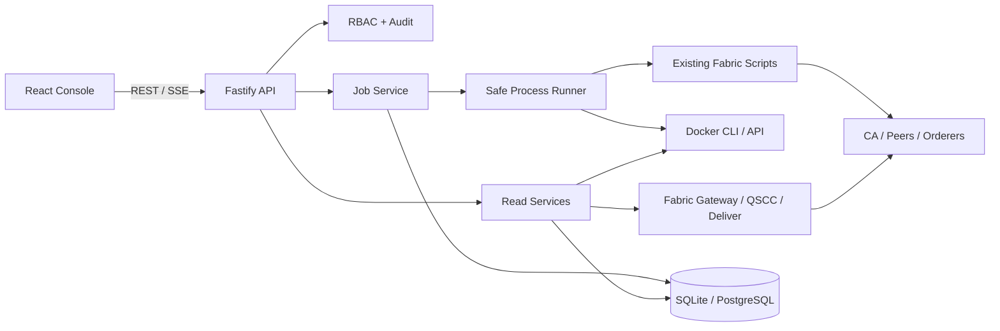

# Fabric Control Plane Architecture

## 1. 目标

在现有命令式 Fabric 网络工具之上构建一个通用的 Fabric 多网络控制平面。平台不预置本地网络、演示网络或默认链码，启动时网络注册表可以为空。用户可以创建或导入多个名称、拓扑、通道、组织数量和版本均不同的 Fabric 网络，并获得一致的管理能力：

- 网络部署、停止、恢复和清理；
- 网络配置、组织、通道和节点拓扑展示；
- Peer、Orderer、CA 和链码容器的状态与详情；
- 区块、交易、背书、读写集和验证结果解析；
- 链码生命周期部署、升级、查询和调用；
- 长任务进度、实时日志、审计和权限控制；
- 为 Hyperledger Caliper 预留测试计划和报告接口。

控制台不会替代现有 Bash 流程。第一阶段将稳定脚本封装为受约束的后端作业，后续再逐步用 Fabric Gateway、Deliver Service 和 Docker API 替换 CLI 文本调用。

## 2. 技术决策

采用 TypeScript 全栈 monorepo：

| 层 | 技术 | 选择原因 |
|---|---|---|
| Web | React、Vite、React Router、TanStack Query | 适合高交互拓扑、日志流和区块浏览器 |
| 可视化 | React Flow、ECharts | 分别负责网络拓扑和指标/区块统计 |
| API | Fastify、TypeScript、Zod | 轻量、类型明确，便于安全封装子进程和 SSE |
| Fabric | 现有 CLI adapter，后续 `@hyperledger/fabric-gateway` + `fabric-protos` | 先复用当前流程，再获得结构化区块与事件能力 |
| 状态 | SQLite 起步，Repository 接口预留 PostgreSQL | 当前是单机网络，不提前引入运维复杂度 |
| 作业 | 进程内队列 + 网络级互斥锁，后续可替换 BullMQ/Redis | MVP 简单可控，数据模型保持可迁移 |
| 共享模型 | `packages/shared` | API schema、状态枚举和 DTO 前后端复用 |

## 3. 代码布局

```text
apps/
├── api/                 Fastify 控制平面 API
│   └── src/
│       ├── modules/     network、topology、nodes、blocks、chaincodes、jobs
│       ├── adapters/    shell、docker、fabric-gateway
│       ├── infrastructure/
│       └── server.ts
└── web/                 React 管理控制台
    └── src/
        ├── app/         路由、布局、Provider
        ├── features/    与后端模块对应的页面功能
        ├── components/  通用可视化组件
        └── styles/
packages/
└── shared/              Zod schema、DTO、枚举和共享工具
runtime/                 SQLite、作业日志、临时区块文件；全部忽略
docs/                    架构、路线图和运行手册
```

现有 `network.sh`、`script/`、`upgrade_chaincode.sh` 和 `smart_contract_execute.sh` 作为通用 Fabric Compose driver 的重构输入保留。平台核心不直接依赖 AdaNet、`example.com`、`mychannel` 或任何具体链码名称，也不会自动注册当前工作目录为网络。

## 4. 系统边界



浏览器永远不能读取 MSP 私钥、CA 管理密码、Docker socket 或 Fabric 管理证书。所有高权限操作只在后端 worker 中执行。

## 5. 现有能力映射

| 控制台能力 | 当前实现 | 后端封装方式 |
|---|---|---|
| 网络创建/启动 | `network.sh up` | 异步独占作业 |
| 暂停/恢复 | `network.sh stop/restart` | 异步独占作业 |
| 网络清理 | `network.sh down` | 管理员权限、输入网络名二次确认 |
| 配置与拓扑 | `config/orgs.yaml`、`script/export-network-info.sh` | 结构化只读 API |
| 通道加入 | `script/osnadmin-examples.sh`、`joinChannel.sh` | 网络部署作业步骤 |
| 链码部署 | `upgrade_chaincode.sh` | 分步骤生命周期作业 |
| 链码调用 | `smart_contract_execute.sh` | 参数白名单 + query/invoke API |
| 区块信息 | Fabric CLI/Gateway 尚未封装 | 新增 Block Service |
| Caliper | 尚未接入 | 后续 Test Plan/Run/Report 模块 |

## 6. 后端模块

### 6.1 Network Registry and Drivers

`networkId` 是所有配置、状态、作业、区块和链码资源的第一维。平台可以导入已有网络，也可以创建由本平台管理的新网络：

```ts
type NetworkDefinition = {
  id: string;
  displayName: string;
  driver: 'fabric-compose';
  workspaceRoot: string;
  configPath: string;
  dockerNetwork: string;
  composeProject: string;
  fabricVersion: string;
  fabricCaVersion: string;
  managementMode: 'imported' | 'managed';
};
```

`workspaceRoot` 和 `configPath` 必须经过服务端注册和路径约束，不能由操作 API 提交任意路径。

后端通过通用 driver 接口隔离不同实现：

```ts
interface NetworkDriver {
  getConfig(network: NetworkDefinition): Promise<RedactedNetworkConfig>;
  getTopology(network: NetworkDefinition): Promise<NetworkTopology>;
  getNodeStatuses(network: NetworkDefinition): Promise<NodeStatus[]>;
  runLifecycleAction(network: NetworkDefinition, action: LifecycleAction): AsyncIterable<JobEvent>;
  getBlock(network: NetworkDefinition, channel: string, blockNumber: bigint): Promise<DecodedBlock>;
  deployChaincode(network: NetworkDefinition, request: ChaincodeDeploymentRequest): AsyncIterable<JobEvent>;
  evaluate(network: NetworkDefinition, request: ContractRequest): Promise<ContractResult>;
  submit(network: NetworkDefinition, request: ContractRequest): Promise<ContractResult>;
}
```

多网络隔离要求：

- 每个 managed network 使用独立 `runtime/networks/{networkId}` 工作区；
- Docker Compose project、Docker network、容器名和 volume namespace 唯一；
- 创建或导入时检查宿主机端口冲突；
- 证书、channel artifacts、日志和临时区块文件只存在于对应工作区；
- 锁按 `networkId` 隔离，不同网络的作业可以并行；
- Fabric/CA 版本属于网络定义，不使用平台级单一硬编码版本。

当前脚本仍把仓库根目录当作唯一运行目录。进入多 managed network 阶段前，需要把“平台源码目录”和“网络实例工作区”分离，所有生成路径必须由 driver 显式传入。`network.sh`、现有 Docker Compose 与链码脚本继续作为可独立使用的命令行入口；控制平面只在 driver 中增加参数校验、作业编排和日志适配，不替换这些脚本，也不要求必须通过网页启动网络。

### 6.2 Topology and Node Status

拓扑来源：

1. `config/orgs.yaml`：期望拓扑；
2. Docker inspect：容器、镜像、IP、端口、启动时间、健康状态；
3. Fabric 探测：通道成员、账本高度、Orderer channel list、CA 可达性；
4. 后续 operations/metrics endpoint：TPS、区块高度和资源指标。

节点状态分层显示：

- `configured`：配置中存在；
- `containerRunning`：容器运行；
- `serviceReachable`：节点主服务端口 TCP 可达；
- `fabricReady`：能够完成 Fabric 级查询；
- `degradedReason`：明确说明失败层级。

当前只读观测阶段已实现 `configured`、`containerRunning` 和 `serviceReachable`，并返回经过白名单筛选的容器状态、健康、镜像、IP、端口和时间。对于本机 `fabric-compose` driver，控制平面通过宿主机暴露端口探测 Peer/Orderer 的 gRPC 主端口与 CA 服务端口；容器运行但端口不可达时标记为 `degraded`。该探测只证明 TCP 连接可建立，`fabricReady` 仍明确返回 `null`，待后续完成带身份与 TLS 的 Fabric 级查询后再赋值，不用端口连通状态冒充 Fabric 就绪状态。

### 6.3 Job Service

网络部署和链码生命周期都是长任务：

```text
queued -> running -> succeeded
                  -> failed
                  -> cancelled
```

每个 Job 保存步骤、开始/结束时间、退出码、脱敏后的 stdout/stderr 和操作者。日志通过 SSE 推送。

锁粒度：

- 网络生命周期：`network:{networkId}` 独占；
- 链码部署：`network:{networkId}:channel:{channel}:chaincode:{name}` 独占；
- query 可并发，invoke 受速率限制但不使用全局锁。

所有命令使用 `spawn(executable, args, { shell: false })`；禁止把用户输入拼接进 Shell 字符串。

当前本地实验版本已经实现网络生命周期作业：Job、JobStep 和 JobEvent 持久化到 SQLite；同一 `networkId` 的活动作业由数据库唯一索引互斥；控制平面异常重启时，遗留的等待中或执行中作业会自动标记为失败并释放锁。执行器以注册的 `workspaceRoot` 为工作目录，传入可信的 `CONFIG_FILE` 和 `COMPOSE_PROJECT_NAME`，随后直接执行原 `network.sh` 的 `up`、`stop`、`restart` 或 `down` 参数。stdout/stderr 会去除 ANSI 控制符并进行基础凭据脱敏，既可通过 JSON 查询，也可使用 `Accept: text/event-stream` 实时订阅。

Operations 页面提供四个生命周期入口、作业取消、历史步骤和日志查看。`down` 需要输入网络 ID 确认。当前操作者记录为本地 `local-user`，认证与细粒度 RBAC 仍属于后续加固阶段。

### 6.4 Block Service

区块浏览器需要递归解析 protobuf，而不是只展示 `configtxlator` 的顶层 JSON：

1. 通过 Gateway/QSCC 或 Deliver Service 获取指定区块；
2. 使用 `fabric-protos` 解码 `common.Block`；
3. 继续解码 Envelope、Payload、ChannelHeader、Transaction；
4. 解码 ChaincodeAction、endorsements、TxReadWriteSet 和 KVRWSet；
5. 对 UTF-8/JSON 参数和写入值提供可读视图，同时保留 hex/base64 原值。

“明文解析”的边界必须在 UI 中明确：

- 公共交易参数、公共状态写集可以解析；
- transient data 不会上链，无法从区块恢复；
- PDC 私有值不在公共区块中，只能看到哈希；
- 只有具备集合权限的组织才能另行查询当前私有数据；
- 加密后的业务字段只能展示密文，除非系统另有解密密钥与授权。

### 6.5 Chaincode Service

核心平台不绑定任何具体链码。初期只允许从服务端注册的 Chaincode Catalog 部署受控源码目录，避免通过上传任意链码获得宿主机/Docker 执行能力。Catalog 由管理员显式维护，不预置演示条目。

部署流程：预检 → package → install → approve → readiness → commit → verify。每一步都成为 Job Step，失败后可以从安全步骤重试。

执行台支持：

- channel、chaincode、organization、query/invoke；
- function 和 JSON 参数；
- endorsement target organizations；
- transient JSON，日志与审计中始终脱敏；
- 执行结果、交易 ID、验证状态和耗时。

## 7. API 草案

```text
GET    /api/v1/system/health
GET    /api/v1/networks
POST   /api/v1/networks/import
GET    /api/v1/networks/:id/config
GET    /api/v1/networks/:id/topology
GET    /api/v1/networks/:id/nodes
GET    /api/v1/networks/:id/nodes/:nodeId
POST   /api/v1/networks/:id/actions/:action

GET    /api/v1/jobs
GET    /api/v1/jobs/:jobId
GET    /api/v1/jobs/:jobId/events
POST   /api/v1/jobs/:jobId/cancel

GET    /api/v1/networks/:id/channels/:channel/blocks
GET    /api/v1/networks/:id/channels/:channel/blocks/:number
GET    /api/v1/networks/:id/transactions/:txId

GET    /api/v1/networks/:id/chaincodes
POST   /api/v1/networks/:id/chaincodes/deployments
POST   /api/v1/networks/:id/contracts/evaluate
POST   /api/v1/networks/:id/contracts/submit
```

## 8. 前端信息架构

```text
Networks
├── Fleet Overview
├── Create / Import Network
└── Network Selector
Selected Network
├── Overview
├── Topology
├── Nodes
├── Configuration
└── Operations
Ledger
├── Channels
├── Blocks
└── Transactions
Chaincodes
├── Catalog
├── Installed / Committed
├── Deployments
└── Execute
Testing
└── Caliper (later)
```

视觉方向是亮色“工业网络观测站”：白色与浅灰工作台、深青状态信号、琥珀色告警、紧凑的运行数据与宽松的分析详情并存。Hash、证书 ID 和区块字段使用等宽字体，状态不只依赖颜色，还提供图标和文字。

## 9. 安全要求

- 初期至少使用本地管理员 token；生产阶段接 OIDC 与角色权限；
- `down`、链码部署和 invoke 属高风险操作，必须审计；
- API 不返回 `admin_password`、私钥路径内容、transient 内容；
- 日志过滤 PEM、密码、token、Authorization 和 transient payload；
- Docker socket 与 Fabric 管理身份放入独立 worker 权限域；
- 上传文件、链码路径和 collections 配置必须限制在受控目录；
- 所有 destructive action 都要显式确认，不允许 GET 触发写操作。

## 10. 非目标

第一阶段不做：

- 多租户 SaaS；
- Kubernetes Fabric Operator；
- 浏览器直接持有 Fabric 身份；
- 任意链码源码上传与执行；
- Caliper 实际压测执行；
- 从公共区块恢复 transient 或 PDC 历史明文；
- 预置任何网络实例、演示链码或领域业务页面。
